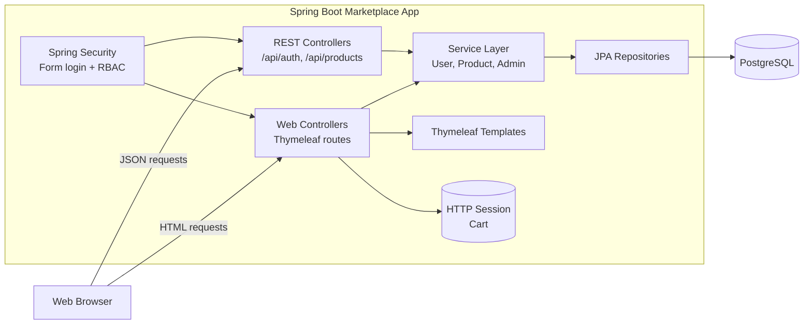
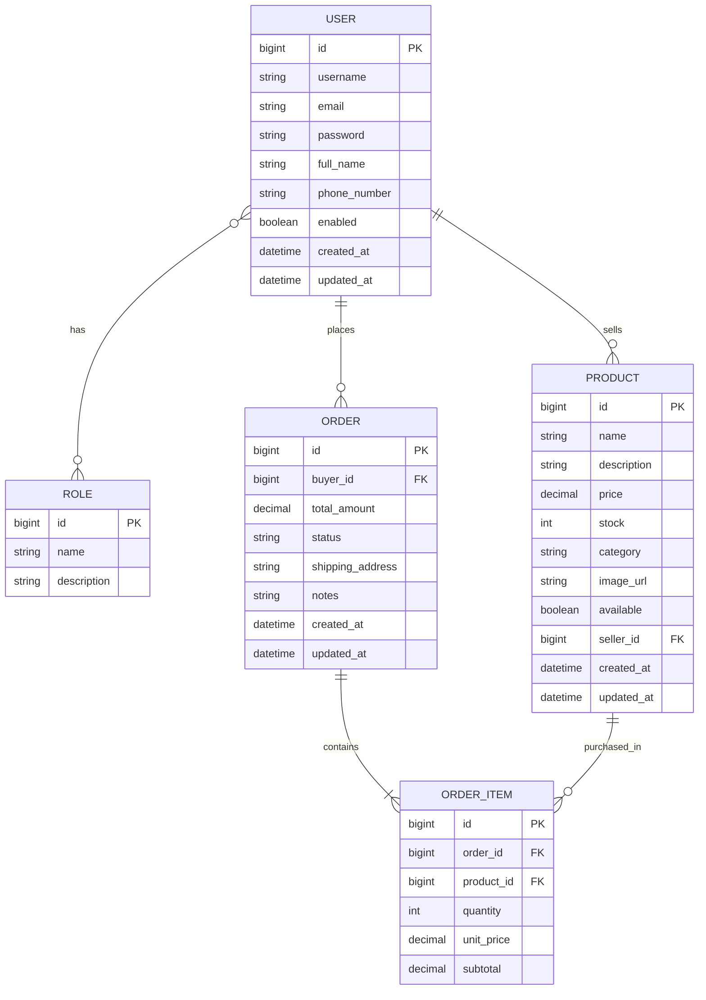

# Marketplace Project

Role-based online marketplace built with Spring Boot, Thymeleaf, Spring Security, and Spring Data JPA.

The application supports three business roles:

- Admin: manage users and monitor platform orders
- Seller: manage own products and update order delivery status
- Buyer: browse products, use cart/checkout, place and cancel eligible orders

## Table of Contents

- [Project Description](#project-description)
- [Architecture Diagram](#architecture-diagram)
- [ER Diagram](#er-diagram)
- [Tech Stack](#tech-stack)
- [Project Structure](#project-structure)
- [Security Model](#security-model)
- [Data Initialization](#data-initialization)
- [API Endpoints](#api-endpoints)
- [Run Instructions](#run-instructions)
- [Testing](#testing)
- [CI/CD Explanation](#cicd-explanation)
- [Production Notes](#production-notes)

## Project Description

This is a monolithic Spring MVC application with server-rendered views and a REST layer for auth/product operations.

Core business flows:

- User registration and form-based login
- Role-based dashboard routing (`/admin`, `/seller`, `/buyer`)
- Product catalog browsing, search, category filtering
- Seller-owned product CRUD
- Session-based cart for buyers
- Checkout and order placement
- Seller order status transitions
- Buyer cancellation of eligible orders
- Inventory auto-decrement on purchase and restock on cancellation

## Architecture Diagram



## ER Diagram



## Tech Stack

- Java 21
- Spring Boot 4.0.3
- Spring MVC + Thymeleaf
- Spring Security (form login + role-based authorization)
- Spring Data JPA (Hibernate)
- PostgreSQL (runtime)
- H2 (tests)
- Maven Wrapper
- Docker + Docker Compose

## Project Structure

```text
marketplace-project/
	src/main/java/com/lab/marketplace/
		config/          # Security and startup data seeding
		controller/      # Web and REST controllers
		dto/             # Request/response DTOs
		entity/          # JPA entities
		exception/       # Exception and REST error response handling
		repository/      # Spring Data JPA repositories
		security/        # UserDetailsService and auth wiring
		service/         # Business services
	src/main/resources/
		templates/       # Thymeleaf pages and fragments
		static/          # CSS and JS assets
		application.yaml # Runtime config
	src/test/
		java/            # Unit tests
		integration/     # Integration tests
		resources/       # Test config
	.github/workflows/
		ci-cd.yml        # GitHub Actions pipeline
	Dockerfile
	compose.yaml
	pom.xml
```

## Security Model

Security is configured in `SecurityConfig`.

- Public: `/`, `/home`, `/login`, `/register`, `/products/**`, static assets, selected auth/product APIs
- Admin only: `/admin/**`
- Seller only: `/seller/**`
- Buyer only: `/buyer/**`, `/cart/**`, `/orders/checkout`, `/orders/place`, `/orders/confirmation`

Authentication uses Spring Security form login with session cookies (`JSESSIONID`).

## Data Initialization

On startup, `DataInitializer` seeds:

- Roles: `ADMIN`, `SELLER`, `BUYER`
- Default admin user:
	- username: `admin`
	- password: `changeMeAdmin`
- Default seller user:
	- username: `seller`
	- password: `changeMeSeller`
- Starter products for initial catalog availability

Change seeded credentials immediately for non-development environments.

## API Endpoints

### Web Endpoints (Thymeleaf)

| Method | Path | Access | Purpose |
|---|---|---|---|
| GET | `/` | Authenticated redirect | Route user to role dashboard |
| GET | `/home` | Public | Home alias page |
| GET | `/login` | Public | Login page |
| GET | `/register` | Public | Register page |
| POST | `/register` | Public | Submit registration |
| GET | `/products` | Public | Product listing/filtering |
| GET | `/products/search` | Public | Search view |
| GET | `/products/{id}` | Public | Product details |
| GET | `/products/details-preview` | Public | Preview helper route |
| GET | `/buyer/dashboard` | Buyer | Buyer dashboard |
| GET | `/buyer/orders` | Buyer | Buyer orders page |
| GET | `/buyer/orders/statuses` | Buyer | Buyer order status JSON |
| POST | `/buyer/orders/{orderId}/cancel` | Buyer | Cancel eligible order |
| GET | `/cart` | Buyer | Cart page |
| POST | `/cart/add` | Buyer | Add product to cart |
| POST | `/cart/update` | Buyer | Update cart quantity |
| POST | `/cart/remove` | Buyer | Remove cart item |
| GET | `/orders/checkout` | Buyer | Checkout page |
| POST | `/orders/place` | Buyer | Place order |
| GET | `/orders/confirmation` | Buyer | Order confirmation |
| GET | `/seller/dashboard` | Seller | Seller dashboard |
| GET | `/seller/products` | Seller | Seller products |
| GET | `/seller/products/new` | Seller | New product form |
| GET | `/seller/products/{id}/edit` | Seller | Edit product form |
| POST | `/seller/products` | Seller | Create product |
| POST | `/seller/products/{id}` | Seller | Update product |
| GET | `/seller/products/search` | Seller | Seller product search |
| GET | `/seller/orders` | Seller | Seller orders |
| POST | `/seller/orders/{orderId}/status` | Seller | Update order status |
| GET | `/admin/dashboard` | Admin | Admin dashboard |
| GET | `/admin/users` | Admin | Admin users page |
| POST | `/admin/users/{userId}/toggle-status` | Admin | Enable/disable user |
| GET | `/admin/orders` | Admin | Admin orders page |

### REST Endpoints

#### Auth APIs

| Method | Path | Access | Purpose |
|---|---|---|---|
| POST | `/api/auth/register` | Public | Register user |
| POST | `/api/auth/login` | Public | Validate credentials |
| GET | `/api/auth/me` | Authenticated | Current user profile |
| GET | `/api/auth/users/{username}` | Public in current config | Fetch user by username |

#### Product APIs

| Method | Path | Access | Purpose |
|---|---|---|---|
| GET | `/api/products` | Public | List products |
| GET | `/api/products/{id}` | Public | Product details |
| GET | `/api/products/search?keyword=...` | Public | Search products |
| GET | `/api/products/category/{category}` | Public | List by category |
| GET | `/api/products/seller` | Seller | My products |
| POST | `/api/products` | Seller | Create product |
| PUT | `/api/products/{id}` | Seller | Update owned product |
| DELETE | `/api/products/{id}` | Seller | Delete owned product |

## Run Instructions

### Prerequisites

- JDK 21
- PostgreSQL 14+ (for local runtime)
- Docker Desktop (optional, for containerized run)

### Environment Variables

Set these before running locally:

- `SPRING_DATASOURCE_URL`
- `SPRING_DATASOURCE_USERNAME`
- `SPRING_DATASOURCE_PASSWORD`
- `SPRING_SECURITY_USER_NAME`
- `SPRING_SECURITY_USER_PASSWORD`
- `JWT_SECRET`
- `SERVER_PORT` (optional, default: `8080`)

PowerShell example:

```powershell
$env:SPRING_DATASOURCE_URL="jdbc:postgresql://localhost:5432/marketplace"
$env:SPRING_DATASOURCE_USERNAME="postgres"
$env:SPRING_DATASOURCE_PASSWORD="postgres"
$env:SPRING_SECURITY_USER_NAME="local-admin"
$env:SPRING_SECURITY_USER_PASSWORD="local-admin-password"
$env:JWT_SECRET="replace-with-a-long-random-secret"
$env:SERVER_PORT="8080"
```

### Run Locally (Maven Wrapper)

Standard:

```powershell
./mvnw.cmd clean spring-boot:run
```

Windows fallback if shell parsing fails:

```powershell
java -classpath ".mvn/wrapper/maven-wrapper.jar" "-Dmaven.multiModuleProjectDirectory=$PWD" org.apache.maven.wrapper.MavenWrapperMain clean spring-boot:run
```

Open: `http://localhost:8080`

If port `8080` is occupied, set `SERVER_PORT` first.

### Run with Docker Compose

1. Create `.env` in project root with:
	 - `POSTGRES_DB`
	 - `POSTGRES_USER`
	 - `POSTGRES_PASSWORD`
	 - `SPRING_SECURITY_USER_NAME`
	 - `SPRING_SECURITY_USER_PASSWORD`
	 - `JWT_SECRET`
	 - `APP_PORT` (optional, default host `8082`)
2. Build and start:

```powershell
docker compose up --build
```

Open: `http://localhost:8082`

## Testing

Run all tests:

```powershell
./mvnw.cmd test
```

Test profile notes:

- Uses H2 in-memory DB from `src/test/resources/application.yaml`
- Includes service/entity/security unit tests
- Includes integration tests for repositories

## CI/CD Explanation

The GitHub Actions workflow is defined in `.github/workflows/ci-cd.yml`.

Trigger behavior:

- On push to any branch except `main` and `develop`
- On pull requests targeting `main` or `develop`

Pipeline flow:

1. Provision CI PostgreSQL service (`postgres:16-alpine`) with health checks
2. Checkout repository
3. Set up Java 21 (Temurin) with Maven dependency cache
4. Compile project: `mvn clean compile -B`
5. Run tests against CI PostgreSQL: `mvn test -B`
6. Package artifact: `mvn package -DskipTests -B`
7. Publish run summary to GitHub Step Summary

Outcome:

- PRs get automated compile/test validation
- Packaged JAR is produced in CI after successful test stage

## Production Notes

- Enable CSRF protection for production
- Replace seeded default credentials
- Use secret management (not plain env files in shared infra)
- Reduce SQL/security debug logging levels
- Consider DB migrations (Flyway/Liquibase)
